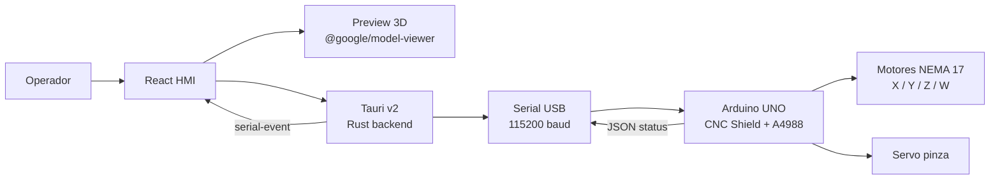

# HMI Brazo SCARA

HMI de escritorio para controlar y previsualizar un brazo SCARA con Arduino UNO, CNC Shield, drivers A4988, motores NEMA 17 y pinza servo.

La app combina control serial directo, estado en vivo y una previsualizacion 3D del robot para validar movimientos antes o durante la operacion.

## Caracteristicas

| Area | Estado | Detalle |
|---|---:|---|
| Control serial | Listo | Conexion directa al Arduino por USB a `115200` baudios. |
| Ejes | Listo | X, Y, Z y W con unidades segun firmware: grados para X/Y/W y milimetros para Z. |
| Pinza | Listo | Botones de abrir/cerrar y previsualizacion lateral de las mordazas. |
| Modelo 3D | Listo | Modelo optimizado en `public/robot.gltf` + `public/robot.bin`. |
| Estado en vivo | Listo | Lectura de respuestas JSON emitidas por el firmware. |
| Updater | Listo | Actualizaciones por release de GitHub usando `latest.json`. |
| Firmware | Incluido | Codigo Arduino en `codigo_arduino/Miguel_Brazo`. |

## Arquitectura



## Estructura del proyecto

```txt
.
├── src/                         # Frontend React + TypeScript
│   ├── main.tsx                 # UI, control serial y rig del modelo 3D
│   ├── styles.css               # Estilos de la HMI
│   └── assets/brand/            # Marca e imagenes
├── src-tauri/                   # App desktop Tauri v2
│   ├── src/lib.rs               # Backend serial y comandos Tauri
│   ├── tauri.conf.json          # Configuracion, updater y bundle
│   └── capabilities/            # Permisos de escritorio
├── public/
│   ├── robot.gltf               # Modelo 3D usado por la app
│   └── robot.bin                # Binario del modelo 3D
├── codigo_arduino/Miguel_Brazo/ # Firmware Arduino y protocolo
├── scripts/
│   └── make-latest-json.ps1     # Genera latest.json para el updater
└── modelo_nuevo/                # Area temporal para importar modelos nuevos
```

## Flujo de comunicacion

La HMI envia un comando de texto por linea. El firmware responde exclusivamente con JSON delimitado por salto de linea.

```txt
PING
STATUS
ENABLE
MOVE X DEG 30
MOVE Z MM 20
GRIPPER OPEN
```

Ejemplo de respuesta:

```json
{"ok":true,"type":"pong"}
```

La app no parsea menus humanos del monitor serial. Si se cambia el protocolo, revisar primero:

- `codigo_arduino/Miguel_Brazo/README_PROTOCOL.md`
- `codigo_arduino/Miguel_Brazo/Protocol.cpp`
- `codigo_arduino/Miguel_Brazo/Config.h`
- `codigo_arduino/Miguel_Brazo/Axis.h`

## Requisitos

| Herramienta | Uso |
|---|---|
| Node.js 24+ | Frontend, scripts y build de Tauri |
| Rust + Cargo | Backend Tauri |
| Visual Studio Build Tools | Compilacion nativa en Windows |
| Arduino IDE o CLI | Cargar firmware al Arduino UNO |

Si PowerShell no encuentra `cargo`, cerrar y abrir la terminal. Si sigue igual:

```powershell
$env:Path = "$env:USERPROFILE\.cargo\bin;$env:Path"
```

## Desarrollo

Instalar dependencias:

```powershell
npm install
```

Levantar la app desktop en modo desarrollo:

```powershell
npm run tauri dev
```

Validar frontend:

```powershell
npm run build
```

## Uso basico

1. Conectar el Arduino por USB.
2. Abrir la app.
3. Presionar `Actualizar`.
4. Seleccionar el puerto serial.
5. Presionar `Conectar`.
6. Enviar `PING` o `STATUS` para verificar comunicacion.
7. Usar `ENABLE`, homing y controles de movimiento.

## Modelo 3D

La app carga el modelo desde:

```txt
public/robot.gltf
public/robot.bin
```

`modelo_nuevo/` se usa solo como carpeta de trabajo para importar modelos actualizados. Para que un modelo llegue a la app final, debe quedar copiado en `public/` con esos nombres.

## Release y updater

Para publicar una version nueva:

```powershell
npm run build:app
npm run release:json
```

Luego se debe crear un release de GitHub con:

- Instalador NSIS `.exe`
- Firma `.sig`
- `latest.json`

La app consulta:

```txt
https://github.com/Miguellunab/HMI-Rotty/releases/latest/download/latest.json
```

## Stack

| Capa | Tecnologia |
|---|---|
| Desktop | Tauri v2 |
| Frontend | React 19 + TypeScript + Vite |
| 3D | `@google/model-viewer` + Three.js scene graph |
| Backend | Rust + `serialport` |
| Firmware | Arduino C++ |
| Distribucion | GitHub Releases + Tauri updater |

## Verificacion recomendada

```powershell
npm run build
npx tauri info
```

Para release:

```powershell
npm run build:app
npm run release:json
```
